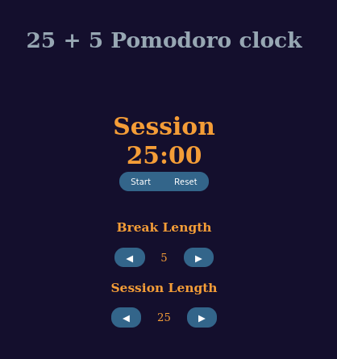

# Pomodore Clock
This is one of the five projects required by FreeCodeCamp to reach the *Front End Development Libraries* certificate.

I made this project in codepen but now i will adjust it a little to work with nodejs (this is a work in progress)

## Try the original in my codepen
https://codepen.io/hiraion/full/bGYGmgO

## Screenshot

